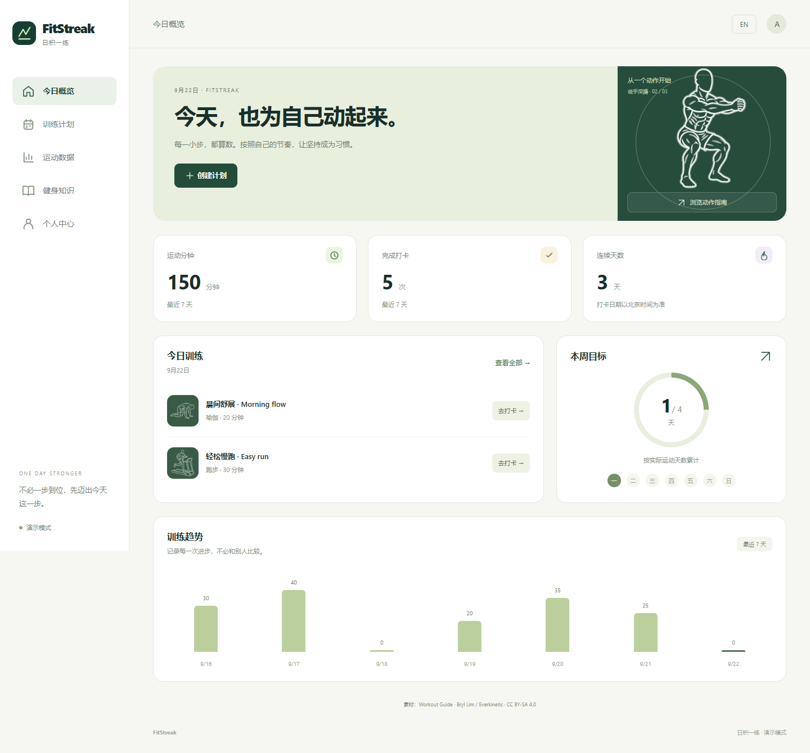

# FitStreak · 日积一练

面向日常健身记录的微信小程序及响应式网页。支持计划创建与归档、每日打卡、数据统计、知识阅读、个人设置和简体中文／英文。所有代码、设计源文件及需求文档统一版本管理。



## 交付物导航

|内容|路径|
|---|---|
|需求分析 Word|[FitStreak-需求分析.docx](docs/FitStreak-需求分析.docx)|
|需求文本与编号|[requirements.md](docs/requirements.md)|
|国内外技术调研与选型|[research.md](docs/research.md)|
|系统架构 / 技术选型 / E-R 图|[docs/diagrams](docs/diagrams)（drawio、SVG、Mermaid）|
|数据库设计及字典|[database.md](docs/database.md)|
|建表、种子、查询 SQL|[database](database)|
|可编辑原型及离线交互预览|[design](design)|
|前端 / 后端|[apps/web](apps/web) / [apps/api](apps/api)|
|OpenAPI 合同|[openapi.json](docs/api/openapi.json)|
|Mock / 自动化测试|[mocks](mocks) / [tests](tests)|
|测试状态及验收限制|[testing.md](docs/testing.md)|

## 本地启动

需要 Node.js 22 或更新版本，首次运行 `npm ci`。默认本地开发无需安装数据库：PGlite 在 `.data/fitstreak` 持久化数据。启动命令在两个终端运行：

```sh
npm run dev:api
npm run dev
```

打开 http://127.0.0.1:5173 ，点击开始使用生成独立演示账号。API文档在 http://127.0.0.1:3000/docs 。默认开发 JWT 密钥为进程随机值，重启后须重新登录；需要稳定本地会话时复制 `apps/api/.env.example` 为 `.env` 并设置自己的随机密钥。

独立 PostgreSQL 的本机连接、pgAdmin/Navicat 查看表、数据迁移与测试隔离，见 [Windows 本地 PostgreSQL](docs/postgresql-local.md)。配置 `apps/api/.env` 的 `DATABASE_URL` 后，后端使用 PostgreSQL；运行 `npm run db:status` 可确认连接与记录数量。

## 使用 MSW 开发预览

两个终端分别运行：

```sh
npm run dev:mock
npm run dev:web:mock
```

Mock 端口为3001，前端为5173。Mock 只用于开发和测试，数据在进程内，重启会重置。可访问 `http://127.0.0.1:3001/__reset?scenario=empty` 切换为空数据；支持 normal、empty、slow、error、unauthorized。不要把 Mock 端口公开部署。

## 构建与验证

```sh
npm run build
npm test
npm run test:e2e
npm run test:live
npm run api:export
```

Windows 浏览器测试默认使用已安装的 Edge，Linux CI 使用 Playwright Chromium。其他环境可调整 `playwright.config.ts`。小程序输出位于 `apps/web/dist/build/mp-weixin`，H5输出位于 `apps/web/dist/build/h5`。构建产物不进入Git，CI作为可下载构建附件保存。

## 微信与生产环境

1. 将 `apps/web/src/manifest.json` 的 `mp-weixin.appid` 替换为自己的真实AppID。前端 `.env.local` 设置 `VITE_AUTH_MODE=live` 和 HTTPS API地址。
2. 服务端配置 WECHAT_APP_ID / WECHAT_APP_SECRET、JWT_SECRET（至少32个随机字符）、DATABASE_URL、NODE_ENV=production、DEMO_MODE=false、CORS_ORIGIN。真实密钥仅写入部署环境，不提交Git。
3. PostgreSQL可用 `docker compose up -d` 启动，先设置 POSTGRES_PASSWORD。应用启动执行可重入建表与知识种子SQL。正式服务使用反向代理提供HTTPS，并将域名配置到微信小程序合法请求域名。
4. 微信开发者工具导入编译目录，再完成真机登录、网络、字体、安全区和统计验收。当前使用touristappid可编译，但不表示正式微信登录已通过。

应用采用模块化单体。默认用户数据按会话隔离；打卡日期由服务端按北京时间计算。计划归档保留历史。H5正式微信账号登录不在首期范围，H5支持演示预览，小程序承载正式登录。

## 修改设计文档

`scripts/build-docs.py` 从需求文本生成Word，从结构数据生成三张图和多页drawio原型。需要 Python 的 python-docx；运行 `python scripts/build-docs.py`。使用 diagrams.net 打开 `.drawio` 源文件，原型 `design/prototype.html` 可直接离线打开。修改生成文件时同步修改生成源，避免下次生成覆盖。

文档在CI使用 `scripts/render_docx.py` 转页图，人工检查分页和中文字体。软件交付与微信正式上线验收的状态以测试报告为准。

全部交付项及待实际环境验收项见 [交付清单](docs/delivery-checklist.md)。
